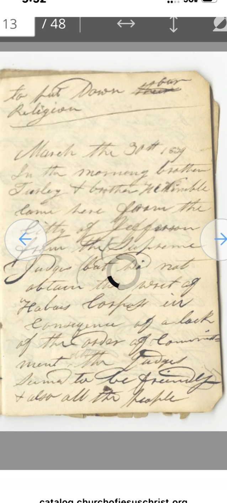

## March 1839 – Liberty Jail Entries

---
title: "Hyrum Smith Journal – March 31, 1839"
date: 1839-03-31
location: Liberty Jail, Clay County, Missouri
page_ref: ""
image_ref: "../images/1839-03-31.jpg"
image_working_ref: "../images/processed_safe_crop/1839-03-31.jpg"
image_processed_ref: "../images/processed_full/1839-03-31.jpg"
provenance: "Church History Library, Salt Lake City – MS 9028446 (Hyrum Smith Papers)"
editor: Mark Phillips
source: "Hyrum Smith, Journal from Liberty Jail (March–April 1839)"
tags: ["Liberty Jail", "faith", "deliverance", "1839"]
word_count:
# Editorial Method: Faithful diplomatic transcription preserving original spelling, punctuation, and capitalization. Modernized version follows for readability.
---

### Faithful (Diplomatic) Transcription

<!-- SCAFFOLD_START -->
[Line 001] 
(Transcribe)

[Line 002] 
(Transcribe)

[Line 003] 
(Transcribe)

[Line 004] 
(Transcribe)

[Line 005] 
(Transcribe)

[Line 006] 
(Transcribe)

[Line 007] 
(Transcribe)

<!-- SCAFFOLD_END -->

[Liberty Jail, March 31, 1839 — Page ?]
Transcription draft in progress.  
[End of page ?]

### Modernized (Readable) Transcription
[Liberty Jail, March 31, 1839 — Page ?]  
Transcription draft in progress.
---
*Edited and prepared by Mark Phillips, 2025 Digital Edition.*
