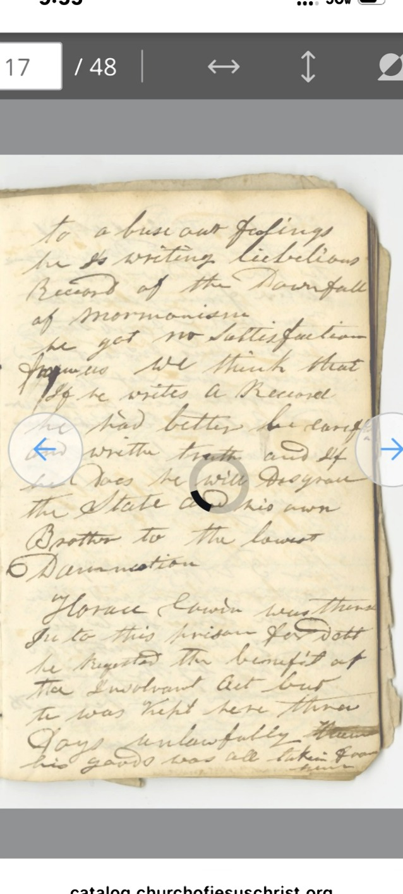
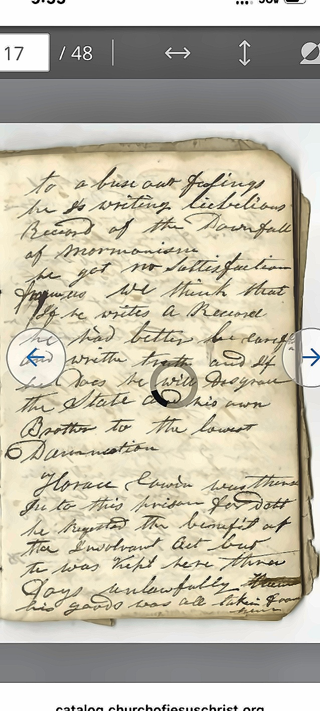

## April 1839 – Liberty Jail Entries

---
title: "Hyrum Smith Journal – April 01, 1839"
date: 1839-04-01
location: Liberty Jail, Clay County, Missouri
page_ref: ""
image_ref: "../images/1839-04-01.jpg"
image_working_ref: "../images/processed_safe_crop/1839-04-01.jpg"
image_processed_ref: "../images/processed_full/1839-04-01.jpg"
provenance: "Church History Library, Salt Lake City – MS 9028446 (Hyrum Smith Papers)"
editor: Mark Phillips
source: "Hyrum Smith, Journal from Liberty Jail (March–April 1839)"
tags: ["Liberty Jail", "faith", "deliverance", "1839"]
word_count:
# Editorial Method: Faithful diplomatic transcription preserving original spelling, punctuation, and capitalization. Modernized version follows for readability.
---

### Faithful (Diplomatic) Transcription

Reference image (enhanced, safe-cropped for transcription):

[Liberty Jail, April 01, 1839 — Page ?]
April the 1 1839
this morning Lord I
I say I slept last
night in a bed for
the first time for
five months the
guard quite still &
the night before last
the guard shouted & halloed
all night no one
slept at all
[End of page ?]

### Modernized (Readable) Transcription
[Liberty Jail, April 1, 1839 — Page ?]
This morning, Lord, I note that I slept in a bed last night for the first time in five months. The guard was quiet. The night before last the guards shouted and hollered all night; no one slept at all.
---
*Edited and prepared by Mark Phillips, 2025 Digital Edition.*
